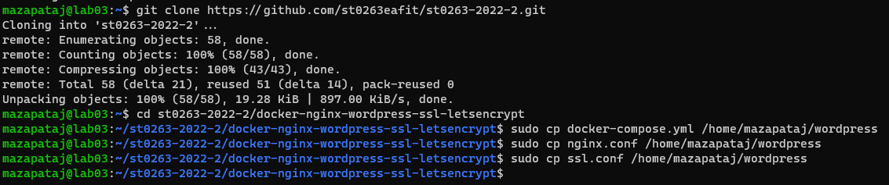
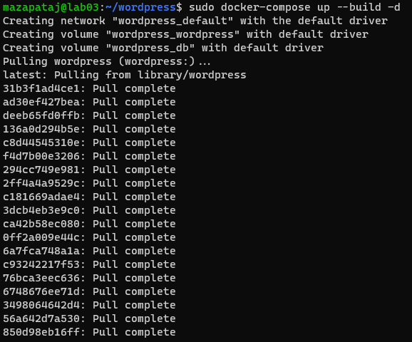
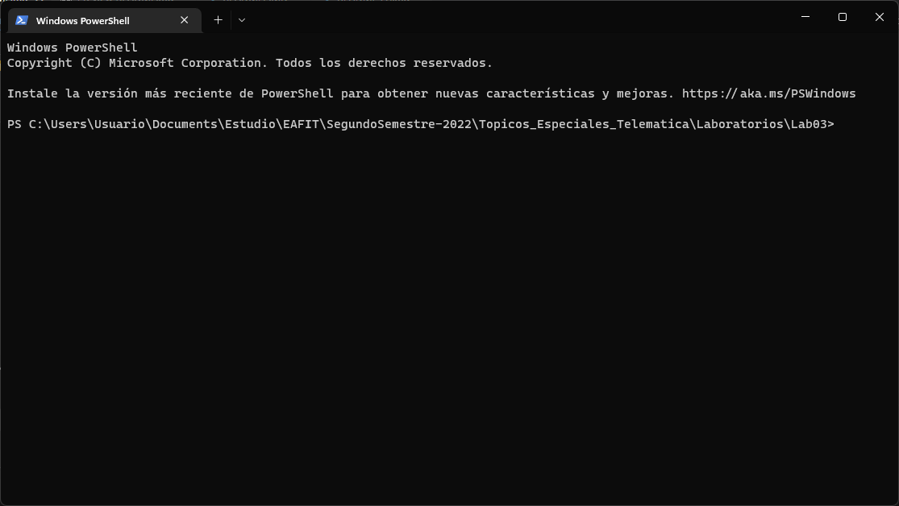

# **Lab03 - Contenedores - Docker - wordpress - dominio - ssl**

### **Información general**  
> Info de la materia: ST0263 Tópicos especiales en telemática  
> Estudiante: Miguel Ángel Zapata Jimenez, mazapataj@eafit.edu.co  
> Profesor: Edwin Nelson Montoya, emontoya@eafit.edu.co  

## **1. Breve descripción de la actividad**
Se desarrollaron habilidades en el proceso de creación, despliegue y gestión de aplicaciones utilizando contenedores, particularmente docker en una maquina de GCP.  
  
### **1.1. Que aspectos cumplió o desarrolló de la actividad propuesta por el profesor (requerimientos funcionales y no funcionales)**  
  
* El servidor esta desplegado en una maquina virutla con sistema operativo Ubuntu en GCP, con Ip elastica.  
* Se creo un servidor de dominio a tráves del DNS de GCP. Adicionalemnte, se asignaron los registros de recurso correspondientes que para este caso fueron: A, CNAME, TXT y NS. Otro punto a tener en cuenta es que se agrego el token especifico del Let´s Encrypt para permitir que el ingreso a la pagina web sea seguro. 
* Se utilizo Let´s Ecrypt para generar un certificado ssl valido para la pagina web de wordpress. 
* Se realizo la instalación de docker en la maquina virtual para poder ejectuar wordpress de manera aislada. 
* Se utilizo certbot para gestionar el certificado ssl y de esta manera configurar el cifrado HTTPS en el servidor web.
* Se realizo la instalación de un servidor nginx que permite la gestion del wordpress.  
* Se implemento un servidor monolitico, es decir, tanto la base de datos como la logica del negocio. se encuentran en el mismo lugar.  
* El puerto habilitado para el protocolo HTTPS es el 443.
  
---  
  
## **2. Información general de diseño de alto nivel, arquitectura, patrones, mejores prácticas utilizadas**  
  
* Se implemento el protocolo HTTPS para el acceso a la pagina web.
* Se utilizo docker para aislar la aplicación de wordpress dentro de la maquina virtual de GCP.  

      
  
  
---  
  
## **3. Descripción del ambiente de desarrollo y técnico: lenguaje de programación, librerias, paquetes, etc, con sus numeros de versiones**  

### **Detalles técnicos**  

**Plataforma de nube usada:** GCP (Google Cloud Platform)  
**Servidor Web:** Nginx (1.18.0)  
**Autoridad de certificación:** Let's Encrypt  
**Cliente para solicitar certificado de Let's Encrypt:** Certbot (1.22)  
  
### **Como se compila y ejecuta**  
1. Iniciar la maquina virtual como se explica en [Lanzar el servidor](#como-se-lanza-el-servidor)  
  
### **3.1. Activación de la infraestructura TI para el desarrollo de la actividad**  
   
1. Luego de haber ingresado a la maquina como se muestra a continación   
  
  
2. Asignación de la dirección ip elastica. Hay que realizar los siguientes pasos:
    * **Como se puede ver la maquina tiene una dirección Ip que es efimera**  
      
      
    * **Se ingresa la maquina y luego hay que ir a la sección donde dice interfaces de red**  
      
      
      
    * **Ingresar a la siguiente opción**
      
      
    * **Luego hay que dirigirse a la sección de** `Direcciones IP`  
      
      
    * **Cuando ingresamos se debe seleccionar una dirección ip y reservarla, luego se asocia a la maquina como se observa**  
      
      
3. Asignación de DNS  
    * **Se solicita un Dominion en la aplicación freenom**  
      
      
    * **Hay que dirigirse a la dirección DNS cloud a traves del buscador**  
      
      
    * **Luego se crea la zona a traves de la siguiente opción**  
      
      
      
    * **Se asignan los registros de recursos correspondiente a la zona creada**  
      
      
    * **En freenom se asignan los registros de recurso NS que nos proporciona freenom**  
      
  
4. Luego de haber realizado todo el proceso anterior se comienza con la configuración de docker, Optención de credenciales, configuración de nginx. Las evidencias se muestran a continuación.  

    * **Verificación de que no haya docker previamente en la maquina**  
      

    * **Instalación de docker**  
      

    * **Comprobación instalación**  
      

    * **Instalar let´s encrypt**  
      

    * **Instalar nginx**  
      

    * **Configuración nginx**  
      

    * **Activar servidor de nginx**  
      

    * **Solicitud de credenciales ssl**  
      

    * **Configuración de las credenciales proporcionadas por let´s encrypt**  
      
    
    * **Creacion de carpetas para wordpress y las credenciales correspondientes**  
      
      

    * **Configuración nginx con ssl**  
      
      

    * **Asignación de la private key**  
     
      

    * **Clonar github y organizar las carpetas de docker**  
      

    * **Instalación de wordpress y configuración**  
      

    * **Resultados finales**  
      

---  
  
## **4. Descripción del ambiente de EJECUCIÓN (en producción) lenguaje de programación, librerias, paquetes, etc, con sus numeros de versiones**  
  
### **Detalles tecnicos**  
**IP:** `34.171.186.110`  
**Dominio:** `mazapataj.tk`  
**URL:** [www.mazapataj.tk](www.mazapataj.tk)

### **Como se lanza el servidor**  
1. Se accede a GCP y se dirige a la siguiente sección `Compute Engine`  

      
      

2. Se selecciona la instancia. Luego se le da en los 3 puntos que se muestra. Posterior a eso, se le en la opción de reanudar/iniciar. 
    > Cabe aclarar que para efectos de esta entrega la maquina no se va a detener hasta que se realize la calificación.  
    
      
      
      
  
3. Con la instancia en ejecución se realiza el siguiente procedimiento: 
    * Al profesor se le envia la clave .ppk y el debe guardarla en alguna carpeta como se muestra a continuación.  
      
    * Luego de eso debe abrir la terminal y situarse en esa carpeta como se muestra a continuación.  
      
    * A continuación, se debe ejecutar el siguiente comando: `ssh -i "wordpres.ppk" mazapataj@34.171.186.110` para ingresar a la maquina virtual.  
      
  
> Dado que la maquina siempre estara encendida no hay necesidad de volver a correr el dokcer, o el servidor nginx ya que no se apagaran.  
  
---  

## **5. Otra información que considere relevante para esta actividad**

### **Referencias**
* [https://github.com/st0263eafit/st0263-2022-2/blob/main/docker-nginx-wordpress-ssl-letsencrypt/README.md](https://github.com/st0263eafit/st0263-2022-2/blob/main/docker-nginx-wordpress-ssl-letsencrypt/README.md)
* [https://www.digitalocean.com/community/tutorials/how-to-install-and-use-docker-on-ubuntu-20-04-es](https://www.digitalocean.com/community/tutorials/how-to-install-and-use-docker-on-ubuntu-20-04-es)
* [https://letsencrypt.org/es/](https://letsencrypt.org/es/)
* [https://certbot.eff.org/](https://certbot.eff.org/)
* [https://wordpress.com/es/](https://wordpress.com/es/)