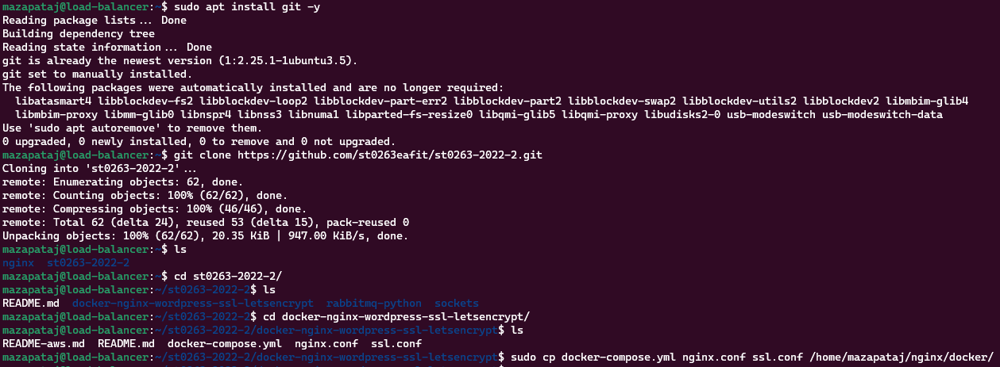

# **Lab04 - Aplicación Monolítica con Balanceo y Datos Distribuidos (BD y archivos)**

### **Información general**  
> Info de la materia: ST0263 Tópicos especiales en telemática  
> Estudiante: Miguel Ángel Zapata Jimenez, mazapataj@eafit.edu.co  
> Profesor: Edwin Nelson Montoya, emontoya@eafit.edu.co  

## **1. Breve descripción de la actividad**  
Tomando como punto de partida la aplicación monolítica desarrollada para el lab3 se busco mejorar la disponibilidad de esta dividiendola en varios nodos. A través de esto, se desarrollaron habilidades en el proceso de creación, despliegue y gestión de aplicaciones utilizando contenedores, particularmente docker en una maquina de GCP. 
  
### **1.1. Que aspectos cumplió o desarrolló de la actividad propuesta por el profesor (requerimientos funcionales y no funcionales)**  
  
* Los servidores wordpress estan desplegados en 2 maquinas virtuales respectivamente con sistema operativo Ubuntu en GCP, con Ip elastica cada uno.  
* Se hizo uso del servicio nginx como frontend para el dominio y certificado. Adicionalmente, se empleo para implementar un balanceador de cargas.
* Se implemento un balanceador de cargas basado en nginx.
* El balanceador de cargas recibe el trafico web https de internet y lo redirige a las múltiples instancias de procesamiento. 
* Se creo un servidor de dominio a tráves del DNS de GCP. Adicionalemnte, se asignaron los registros de recurso correspondientes que para este caso fueron: A, CNAME, TXT y NS. Otro punto a tener en cuenta es que se agrego el token especifico del Let´s Encrypt para permitir que el ingreso a la pagina web sea seguro. 
* Se utilizo Let´s Ecrypt para generar un certificado ssl valido para la pagina web de wordpress. 
* Se realizo la instalación de docker en las siguientes maquinas virtuales: Las dos de wordpress, la encargada de la gestión de la base de datos y en el balanceador de carga. Esto con el fin de poder cada componente sea mas liviano y pueda ejecutarse de manera aislada en cada maquina respectiva. 
* Se utilizo certbot para gestionar el certificado ssl y de esta manera configurar el cifrado HTTPS en el servidor web.  
* El puerto habilitado para el protocolo HTTPS es el 443.  
* Se implemento un servidor de archivos distribuidos nfs para permitir la sincronización entre las dos instancias de wordpress.  
* Se escalo la aplicación del lab3 buscando mejorar la disponibilidad la cual en un inicio era una aplicación monolitica en un solo servidor. Para alcanzar dicha escalabilidad se hizo de varios nodos para que cada uno se encargara de un componente específico.
  
---  
  
## **2. Información general de diseño de alto nivel, arquitectura, patrones, mejores prácticas utilizadas**  
  
* Se implemento el protocolo HTTPS para el acceso a la pagina web.
* Se utilizo docker para aislar cada wordpress dentro de la máquina virtual de GCP donde se encuentra. De igual manera se utilizó docker para aislar el servicio nginx que actua como balanceador y el servicio de la base de datos. 

      
  
  
---  
  
## **3. Descripción del ambiente de desarrollo y técnico: lenguaje de programación, librerias, paquetes, etc, con sus numeros de versiones**  

### **Detalles técnicos**  

**Plataforma de nube usada:** GCP (Google Cloud Platform)  
**Sistema operativo:**  Ubuntu (20.04)  
**Servidor Web:** Nginx (1.18.0)  
**Base de datos:** MySQL (8.0.29)
**Autoridad de certificación:** Let's Encrypt  
**Cliente para solicitar certificado de Let's Encrypt:** Certbot (1.22)  
  
### **Creación de clave ssh y asignación de esta a todas las máquinas**  
  
1. Se hizo uso del servicio wsl de windows. Primero se ingreso a la terminal de comandos de ubuntu. Luego se situa en la carpeta .ssh y se realiza el siguiente comando:  
  
  
2. Se dirige a la sección de configuración y se selecciona la opción metadatos  
  
  
3. Se agrega la clave de la siguiente manera  

  
### **Como se compila y ejecuta**  
1. Iniciar cada máquina virtual como se explica en [Lanzar servidor](#como-se-lanza-el-servidor)  
  
### **3.1. Activación de la infraestructura TI para el desarrollo de la actividad**  
   
1. Asignación de la dirección ip elastica a cada máquina. Para ello, hay que realizar los siguientes pasos:
    * **Como se puede observar la máquina tiene una dirección Ip que es efimera por defecto tanto externa como interna**  
      
      
    * **Se ingresa a la máquina y luego hay que ir a la sección donde dice interfaces de red**  
      
      
      
    * **Ingresar a la siguiente opción**  
      
      
    * **Luego hay que dirigirse a la sección de** `Direcciones IP`  
      
      
    * **Cuando ingresamos se debe seleccionar una dirección ip y reservarla, luego se asocia a la maquina como se observa**  
      

    * **Este proceso se realizó para cada una de las máquinas y como se muestra a continuación todas van a quedar con ip estática**  
    

      
2. Asignación de DNS  
    * **Se solicita un Dominio en la aplicación freenom**  
      
      
    * **Hay que dirigirse a la dirección DNS cloud a traves del buscador**  
      
      
    * **Luego se crea la zona a traves de la siguiente opción**  
      
      
      > Para el caso de este laboratorio se hizo uso de la zona creada en el laboratorio 3
      
    * **Se asignan los registros de recursos correspondiente a la zona creada**  
      
      
      
      
      
    * **En freenom se asignan los registros de recurso NS que nos proporciona GCP**  
      
      
---  
### **3.2. Configuración de la base de datos**  

Luego de haber realizado todo el proceso anterior se comienza con la configuración del docker para la base de datos, creación de usuarios y permisos. A continuación se mostraran las evidencias.  
  
* **Ingresamos a la maquina de la bd**  
  

* **Creación carpeta docker:** `sudo mkdir docker`  
  

* **Se deben realizar los siguientes comandos para instalar docker y docker-compose:**  
    ```bash
        sudo apt install docker.io -y
        sudo apt install docker-compose -y
        sudo systemctl enable docker
        sudo systemctl start docker
        sudo usermod -a -G docker ubuntu
    ```   

* **Se crea un dockerfile:** `sudo nano Dockerfile`  
  

* **Se crea un docker compose:** `sudo nano docker-compose.yaml`   
  

* **Cargar docker compose:** `sudo docker-compose up -d`  
  

* **Verificar que se haya cargado la imagen de mysql:** `sudo docker ps -a`  
  

* **Verificar que el docker compose este corriendo:** `sudo docker-compose ps`  
  
  
* **Configuración de las reglas ufw**  


* **Ingresar a MySQL:** `sudo docker exec -it mysql mysql -p`  
  

* **Creación de base de datos**  
  

* **Creacion de usuario remoto donde solo se le conceden permisos para acceder a la base de datos dbwp**  
  

Luego hay que verificar que cada cliente wordpress se pueda conectar con la base de datos 
* **Ingresar a cada máquina de wordpress y ejecutar el siguiente comando:** `sudo apt install mysql-client`   

* **Comprobar conexión de cada wordpress con mysql:** `mysql -h ip_maquina_db_server -u wp1 -p dbwp`  
  
 
---
  
### **3.3. Configuración del servidor nfs**  
Configuración del servidor nfs. A continuación se mostran las evidencias.  
  
* **Luego de haber ingresado en la máquina se relizara la instalación del servidor nfs:** `sudo apt install nfs-kernel-server`  
  
  
* **Configuración de los permisos al archivo compartido despues de la creación de esta:**   
  

* **Se configura el acceso a los archivos compartidos:** `sudo nano /etc/exports`  
  
  
* **Exportar el directorio nfs:** `sudo exportfs -a`  
  
* **Reiniciar el servidor nfs**: `sudo systemctl restart nfs-kernel-server`    
  
* **Configuración del servicio ufw:**  
  
  
Luego hay que ingresar a cada wordpress e instalar el cliente nfs  
  
* **Instalar nfs-cliente:** `sudo apt install nfs-comon`  
  
* **Configurar archivo fstab para los archivos compartido:** `sudo nano /etc/fstab`  
  
  
* **Probando el nfs compartido:** `sudo mount -a`  
  
* **Verificando carpeta donde se soncronizaran los archivos de los dos wordpress**  

  
---  

### **3.4. Configuración de los wordpress**  
Configuración del docker para las aplicaciones wordpress y el despliegue de estas. A continuación se mostraran las evidencias.  
  
> Este procedimiento se realizó en cada máquina wordpress, pero para efectos de este informe solo se explicara en una máquina wordpress

* **Ingresar a la máquina wordpress**  
  
  
* **Instalar nginx:** `sudo apt install nginx -y`  
  
  
* **Creación de carpeta wordpress:** `sudo mkdir wordpress`  
  
  
* **Se deben realizar los siguientes comandos para instalar docker y docker-compose:**  
    ```bash
        sudo apt install docker.io -y
        sudo apt install docker-compose -y
        sudo systemctl enable docker
        sudo systemctl start docker
        sudo usermod -a -G docker ubuntu
    ```  
  
* **Creación de archivo docker compose:** `sudo nano docker-compose.yaml`  
  
  
* **Creación de carpeta wordpress:** `sudo mkdir wordpress`  
  
  
* **Correr docker compose:** `sudo docker-compose up --build -d`  
  
  
* **Ingresar al browser y dirigirse al wp-admin para la configuración del sitio**  
  

---  
  
### **3.4. Configuración del load balancer y optención de credenciales**  
Configuración del load balancer usando nginx. También, se realizara la optención de las credenciales ssl para la aplicación web.  
  
* **Ingresar a la máquina del load balancer**  
  
  
* **Instalar nginx:** `sudo apt install nginx -y`  
  
  
* **Creación de carpeta nginx:** `sudo mkdir nginx`  

* **Instalar docker y docker-compose:**
    ```bash
            sudo apt install docker.io -y
            sudo apt install docker-compose -y
            sudo systemctl enable docker
            sudo systemctl start docker
            sudo usermod -a -G docker ubuntu
    ```  

* **Se instala git. Luego se clona el github https://github.com/st0263eafit/st0263-2022-2.git. Finalmente, se copian los archivos nginx.conf ssl.conf y docker-compose.yml en la carpeta nginx que se creo**  
  
  
* **Se modifica el archivo docker-compose** `sudo nano docker-compose.yml`  
  
  
* **Se modifica el archivo nginx.conf:** `sudo nano nginx.conf`  
  
  
* **Instalar let´s encrypt:** `sudo apt install letsencrypt -y`  
  
  
* **Instalar certbot:** `sudo snap install certbot --classic`  
  
  
* **Creación carpeta let´s encrypt y activación nginx**  
  
  
* **Solicitud de credenciales para registro especifico**
  
  
* **Solicitud de credenciales para todo el dominio**  
  
  
* **Copiar archivos para registro especifico y para todo el dominio** 
  
  
* **Configuración de nginx con ssl:** `sudo nano options-ssl-nginx.conf`  
  
  
  
* **Asingación de la private key**
  
  
* **Verificar nginx y apagarlo**  
  
  
* **Correr docker compose:** `sudo docker-compose up --build -d`
---  
   
### **3.5. Comprobación de que la aplicación esta activa**  
  
* **Resultado finales:**  
  

---

## **4. Descripción del ambiente de EJECUCIÓN (en producción) lenguaje de programación, librerias, paquetes, etc, con sus numeros de versiones**  
  
### **Detalles tecnicos**  
**IP del load balancer:** `35.188.72.130`  
**IP de la base de datos:** `34.68.168.232`  
**IP del servidor nfs:** `34.173.119.176`  
**IP del wordpress 1:** `35.202.252.116`  
**IP del wordpress 2:** `34.136.76.20`  

**Dominio:** `mazapataj.tk`  
**URL:** [lab4.mazapataj.tk](lab4.mazapataj.tk)

### **Como se lanza el servidor**  
1. Se accede a GCP y se dirige a la siguiente sección `Compute Engine`  

      
      

2. Se selecciona la instancia. Luego se le da en los 3 puntos que se muestra. Posterior a eso, se selecciona en la opción de reanudar/iniciar. 
    > Cabe aclarar que para efectos de esta entrega ninguna de las maquinas se va a detener hasta que se realize la calificación.  
    
      
      
      

3. Después de realizar el proceso anterior para cada máquina todas quedaran activas como se muestra a continuación  

       
  
4. Con la instancia en ejecución se realiza el siguiente procedimiento para ingresar mediante el protocolo ssh: 
    * Al profesor se le envia la clave .pub y el debe guardarla en alguna carpeta como se muestra a continuación.  
      
    * Luego de eso debe abrir la terminal y situarse en esa carpeta como se muestra a continuación.  
      
    * A continuación, se deben ejecutar los siguientes comandos para habilitar la clave:  
        ```bash  
            eval $(ssh-agent -s)  
            ssh-add ~/Ubicacion_donde_guardo_las_claves/lab04
        ```  
      Luego de se ingresa a la maquina con el siguiente comando: `ssh mazapataj@ip_maquina`  
    
        
      > Este proceso se debe repetir siempre que se quiera ingresar a una maquina con ssh  
  
5. En caso de que salga un error que no permita ingresar a la máquina como se muestra a continuación  
  
Se debe utilizar el comando que se muestra en la imagen: `ssh-keygen -R ip_maquina_que_saca_el_error`. Luego se puede ingresar con el comando: `ssh mazapataj@ip_maquina`
  
---  

## **5. Otra información que considere relevante para esta actividad**

### **Referencias**
* [https://github.com/st0263eafit/st0263-2022-2/blob/main/docker-nginx-wordpress-ssl-letsencrypt/README.md](https://github.com/st0263eafit/st0263-2022-2/blob/main/docker-nginx-wordpress-ssl-letsencrypt/README.md)
* [https://www.digitalocean.com/community/tutorials/how-to-install-and-use-docker-on-ubuntu-20-04-es](https://www.digitalocean.com/community/tutorials/how-to-install-and-use-docker-on-ubuntu-20-04-es)
* [https://letsencrypt.org/es/](https://letsencrypt.org/es/)
* [https://certbot.eff.org/](https://certbot.eff.org/)
* [https://wordpress.com/es/](https://wordpress.com/es/)  
* [https://docs.bluehosting.cl/troubleshooting/servidores/como-solucionar-el-mensaje-de-error-la-clave-del-equipo-remoto-ha-cambiado-al-iniciar-sesion-via-ssh.html](https://docs.bluehosting.cl/troubleshooting/servidores/como-solucionar-el-mensaje-de-error-la-clave-del-equipo-remoto-ha-cambiado-al-iniciar-sesion-via-ssh.html)  
* [https://linuxhint.com/install-and-configure-nfs-server-ubuntu-22-04/](https://linuxhint.com/install-and-configure-nfs-server-ubuntu-22-04/)  
* [https://forums.docker.com/t/establish-database-connection-from-docker-wordpress-to-external-database-server/128063/7](https://forums.docker.com/t/establish-database-connection-from-docker-wordpress-to-external-database-server/128063/7)  
* [https://ubunlog.com/wordpress-con-nginx-instala-sobre-ubuntu-20-04/](https://ubunlog.com/wordpress-con-nginx-instala-sobre-ubuntu-20-04/)