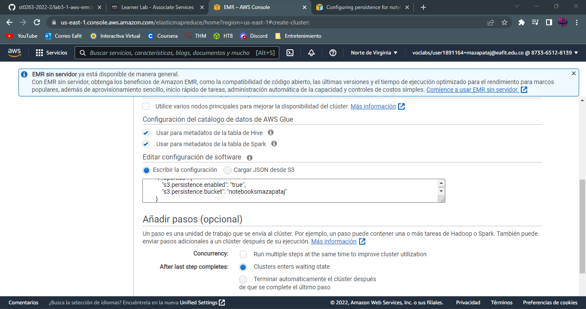

# **Lab05-1**

### **Información general**  
> Info de la materia: ST0263 Tópicos especiales en telemática  
> Estudiante: Miguel Ángel Zapata Jimenez, mazapataj@eafit.edu.co  
> Profesor: Edwin Nelson Montoya, emontoya@eafit.edu.co  
  
## **1. Breve descripción de la actividad**  
Se realizara la creacion de un cluster AWS EMR en Amazon, que permitira el desarrollo de las siguientes actividades de este laboratorio. A tráves, de esta actividad se desarrollaran habilidades en la construcción y destrucción de un cluster en AWS.  
  
### **1.1. Que aspectos cumplió o desarrolló de la actividad propuesta por el profesor (requerimientos funcionales y no funcionales)**  
  
---  
  
## **2. Descripción del ambiente de desarrollo y técnico: lenguaje de programación, librerias, paquetes, etc, con sus numeros de versiones**  
  
### **Detalles técnicos**  
  
**Plataforma de nube usada:** AWS (Amazon Web Services)  
**Sistema operativo:**  Amazon Linux 2 AMI  
**Servicio web utilizado:** EMR (Elastic MapReduce)  
**Puerto para HUE:** 8888  
**Puerto para JupyterHub:** 9443  
**Puerto para Zeppelin:** 8890    
  
### **Como se ejecuta:**  
  
* Realizar lo que se explica en la seccion [Lanzar cluster](#como-se-ejecuta-y-compila)
  
### **2.1. Creación cluster**  
  
* Se busca el servicio EMR  
  
  
* Se selecciona la opción crear cluster  
  
  
#### **Step 1: SoftWare**  
  
* Lo primero que se debe realizar es la configuración de las versiones de los componentes que se usaran en el cluster  
  
  
* Despues se realiza la integración de los catalogos para GLUE, donde se seleccionan las opciones para la visualización de las tablas en Spark y Hive  
  
  
* A continuación, se procede a configurar el bucket para almacenar los datos de los notebooks  
  
  
* Antes de continuar se debe realizar la configuración correcta de la persistencia del bucket  
  
  
#### **Step 2: HardWare**  
  
* En esta paso se debe cambiar el tamaño del hw de los nodos para que estos se puedan ejecutar  
  
  
* Luego se asigna el almacenamiento para cada nodo  
  
  
#### **Step 3: Configuración general del cluster**  

* Se cambia el nombre del cluster y se dejan las demas opciones por defecto  
  
  
#### **Step 4: Seguridad**  

* Se realiza la asignación de la clave .pem  
  
  
* Se crea el cluster y luego se debe esperar a que este se ejecute  
  
  
* Se verifica que el cluster se inicio de manera correcta  
  
  
#### **Configuración de los puertos de entrada**  
  
* Se configuran los puertos para el master  
  
  
### **2.2. Configuración del bucket**  
  
* Se busca el servicio S3 (servicio nfs que proporciona AWS)  
  
  
* Configuración del bucket y creación
  
  
* Se verifica que el bucket quedo creado de manera exitosa  
  
  
* Se visualizan las aplicaciones de interfaz de usuario disponibles  
  
  
* En la opcion de bloqueo de acceso publico (block public access), se deben agregar los puertos correspondientes a cada uno de las interfaces de usuario que se usaran  
  
  
* Despues se editan las politicas de seguridad del master como se muestra a continuación  
  
  
### **2.3. Acceso a las interfaces de usuario**  

#### **HUE**  
  
* Creación de usuario  
  
  
* Ingreso a la plataforma de adminstración  
  
  
* Interfaz de administración de hdfs  
  
  
* Interfaz de administración de S3. En S3 los datos son persistentes y no se perderan asi se destruya el cluster  
  
  
#### **Jupyter Hub**  

* Ingreso a la plataforma. En este caso, jupyter maneja un usuario y contraseña por defecto.  
  
  
* Prueba de notebook pyspark el cual se almacenara en S3   
  
  
* Como se ven los notebooks que tenemos creados en jupyter  
  
  
#### **Zeppelin**  
  
Notebooks que soportan varios lenguajes nativamente.
  
* Acceso a la plataforma  
  
  
* Interacción con la creacion de un notebook nuevo  
  
  
Podemos verificar en el administrador de S3 de HUE que claramente los notebooks se guardan y son persistentes. A continuación, se puede observar como quedan guardados.  

---
  
## **3. Descripción del ambiente de ejecucion: lenguaje de programación, librerias, paquetes, etc, con sus numeros de versiones**  
  
### **Como se ejecuta y compila**  
  
1. Se accede de la siguiente manera luego de que el cluster se encuentre en ejecucion: Se dirije a la carpeta donde esta la clave .pem y se abre la terminal en ese ubicacion. Luego se ejecuta el siguiente comando para ingresar:  
  
  
  
### **Como ingresar a las interfaces de usuario**  
  
Se accede a tráves del browser y las siguientes urls:
  
**URL´S:**  
* **HUE:** http://ec2-44-200-25-176.compute-1.amazonaws.com:8888/  
* **JupyterHub:** https://ec2-44-200-25-176.compute-1.amazonaws.com:9443/  
* **Zeppelin:** http://ec2-44-200-25-176.compute-1.amazonaws.com:8890/  
  
---
## **5. Referencias**  

* [https://github.com/st0263eafit/st0263-2022-2/blob/main/bigdata/lab5-1-aws-emr.txt](https://github.com/st0263eafit/st0263-2022-2/blob/main/bigdata/lab5-1-aws-emr.txt)  
* [https://www.youtube.com/watch?v=MyXSwxN5Zdk](https://www.youtube.com/watch?v=MyXSwxN5Zdk)  
* [https://www.youtube.com/watch?v=3sao-qJG34Y](https://www.youtube.com/watch?v=3sao-qJG34Y)
