# **Lab05-2**

### **Información general**  
> Info de la materia: ST0263 Tópicos especiales en telemática  
> Estudiante: Miguel Ángel Zapata Jimenez, mazapataj@eafit.edu.co  
> Profesor: Edwin Nelson Montoya, emontoya@eafit.edu.co  
  
## **1. Breve descripción de la actividad**  
Se realizara la gestión de archivos via terminal en HDFS. Ademas, se realizara la gestión de archivos via HUE en AWS EMR. Esto permitira desarrollar habilidades con el manejo de HDFS y tener una mayir compresión de la teoria que hay detras del concepto.

### **1.1. Que aspectos cumplió o desarrolló de la actividad propuesta por el profesor (requerimientos funcionales y no funcionales)**  

* Se logro listar archivos HDFS.
* Se logro crear un directorio propio en HDFS.
* Se logro copiar archivos locales hacia HDFS.
* Se logro copiar archivos de HDFS hacia el servidor local.
* Se logro montar archivos via HUE en AWS EMR.
  
---  
  
## **2. Descripción del ambiente de desarrollo y técnico: lenguaje de programación, librerias, paquetes, etc, con sus numeros de versiones**  
  
### **Detalles técnicos**  
  
**Plataforma de nube usada:** AWS (Amazon Web Services)  
**Sistema operativo:**  Amazon Linux 2 AMI  
**Servicio web utilizado:** EMR (Elastic MapReduce)  
**Puerto para HUE:** 8888     
  
### **Como se ejecuta:**  
  
* Realizar lo que se explica en la seccion [Lanzar cluster](#como-se-ejecuta-y-compila)
  
### **2.1. Gestión de archivos en HDFS vía terminal**  
  
* A continuación se muestra como listar archivos: `hdfs dfs -ls /user/<username>` 
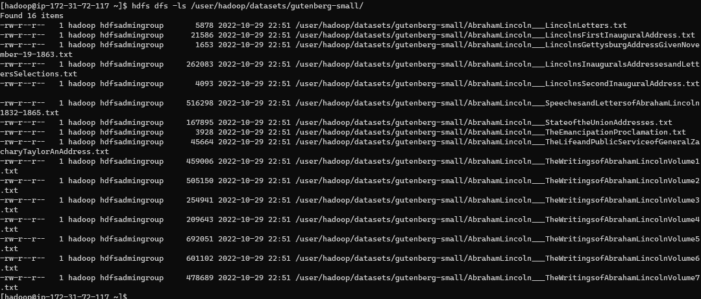  
  
* A continuación se muestra la creación de directorio `hdfs dfs -mkdir /user/<username>/datasets`
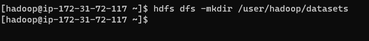   
  
#### **Copiar archivos locales (al servidor gateway) hacia HDFS**
  
* A continuación se muestra como copiar archvivos locales FS en el EMR-MASTER ` hdfs dfs -put /datasets/gutenberg/gutenberg-small.zip /user//datasets/`
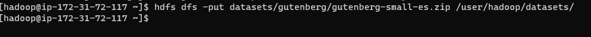  
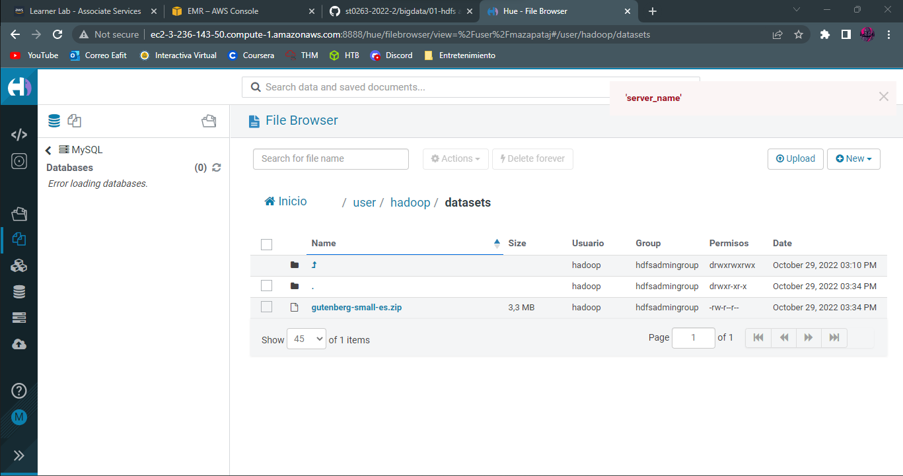  
  
* A continuación se muestra como copiar archivos de amazon S3 hacia HDFS `hadoop distcp s3://st0263datasets/datasets/airlines.csv /tmp/`
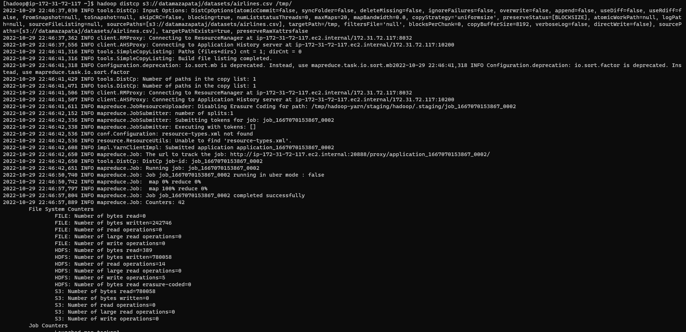  
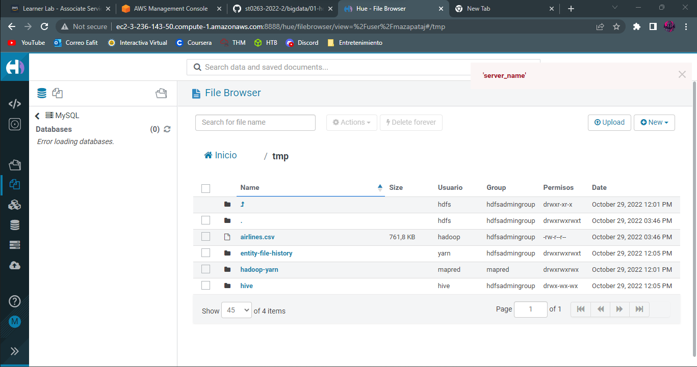  
  
* A continuación se muestra como copiar archivos de manera recursiva  `hdfs dfs -copyFromLocal /datasets/* /user/<username>/datasets/`
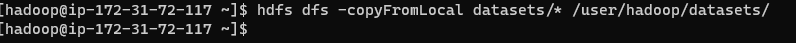  
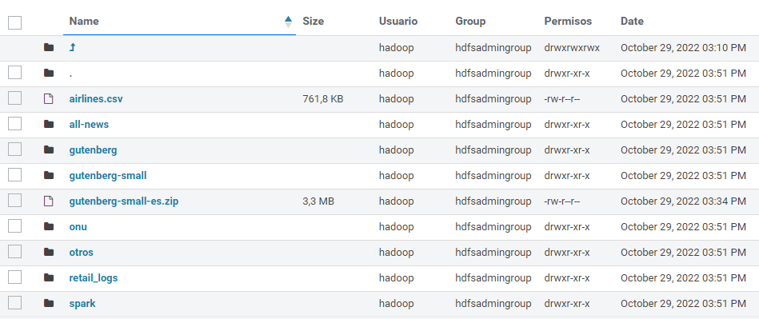
  
#### **Copiar archivos de HDFS hacia el servidor local (gateway)**  
  
* A continuación se muestra como se realiza la copia de archivos  `hdfs dfs -get /user/<username>/datasets/gutenberg-small/* ~<username>/mis_datasets/`
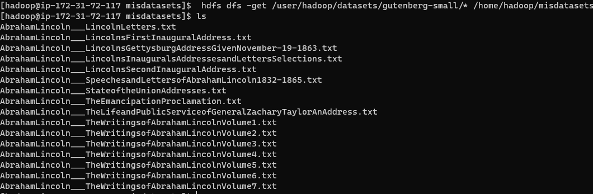  
  
* Otra forma de realizar la copia de archivos `hdfs dfs -copyToLocal /user/<username>/datasets/gutenberg/gutenberg-small.zip ~<username>/mis_datasets/`
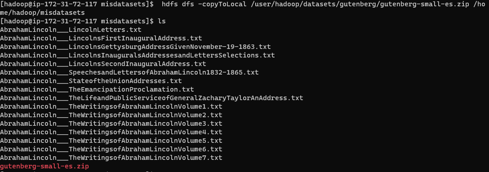  
  
#### **Prueba de otros comandos**  

* Uso de disco en bytes ` hdfs dfs -du`  
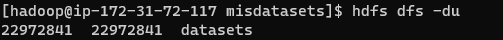  
  
* Mover archivos ` hdfs dfs -mv`  
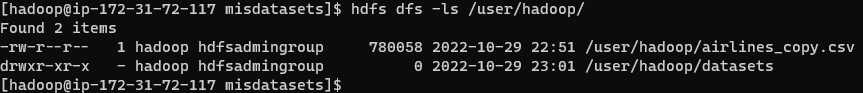  
  
* Copiar archivos ` hdfs dfs -cp`  
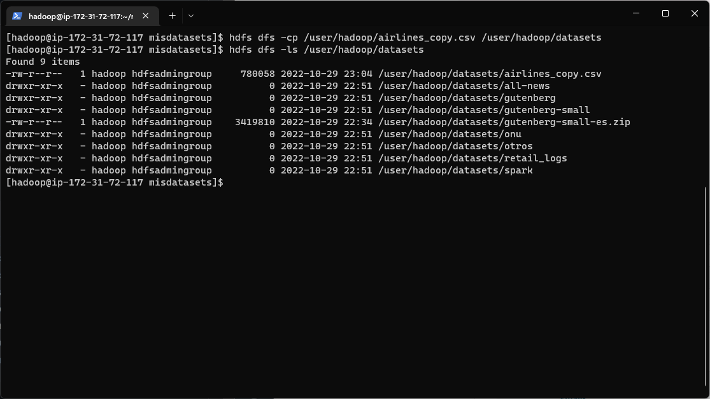  
  
* Borrar archivos ` hdfs dfs -rm`  
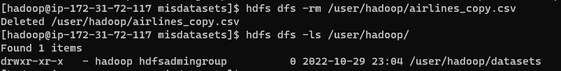  
  
* Mostrar contenido de archivo ` hdfs dfs -cat`  
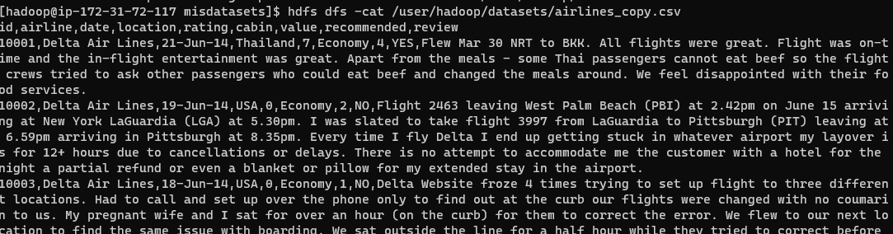  
  
* **chmod:** Cambiar permisos de archivo; **chgrp:** Cambiar el grupo de un archivo `hdfs dfs -chmod` y ` hdfs dfs -chgrp`
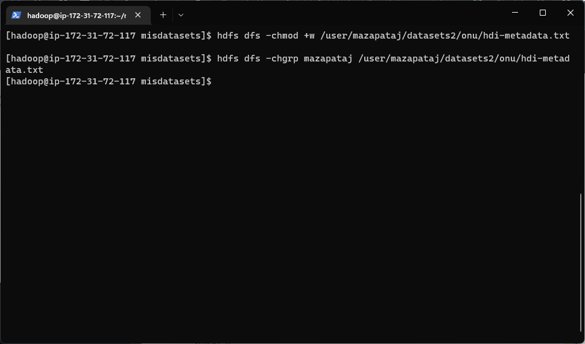  
  
  
### **2.1. Gestión de archivos en HDFS vía HUE en AWS EMR** 

* A continuación se muestra como explorar archivos  
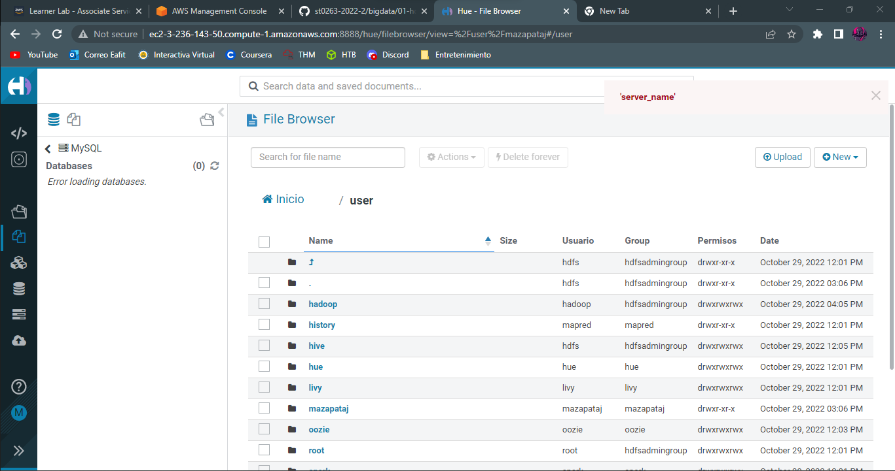  
  
* A continuación se muestra como crear directorios:   
    - Se le da en new, luego en directory y se le agrega el nombre correspondiente  
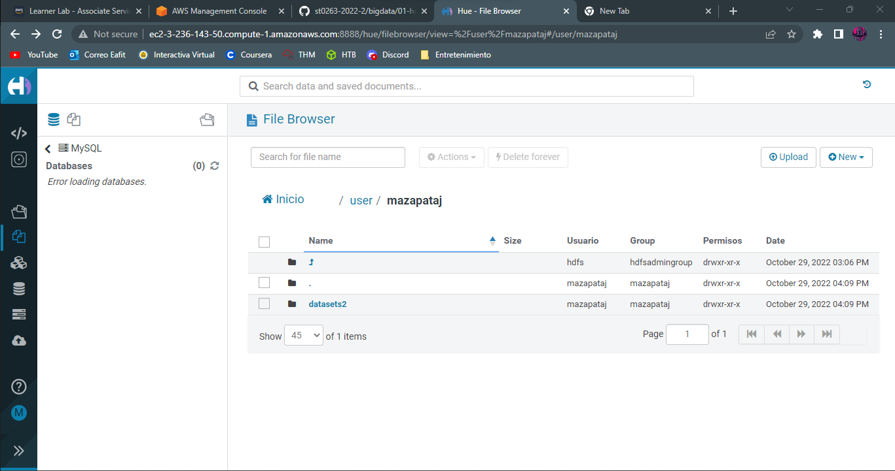  
  
* A continuación se explica como se suben archivos  
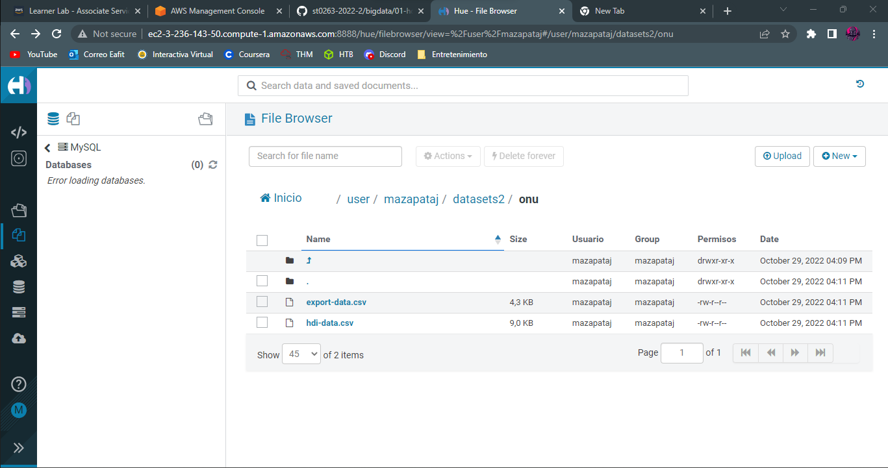  
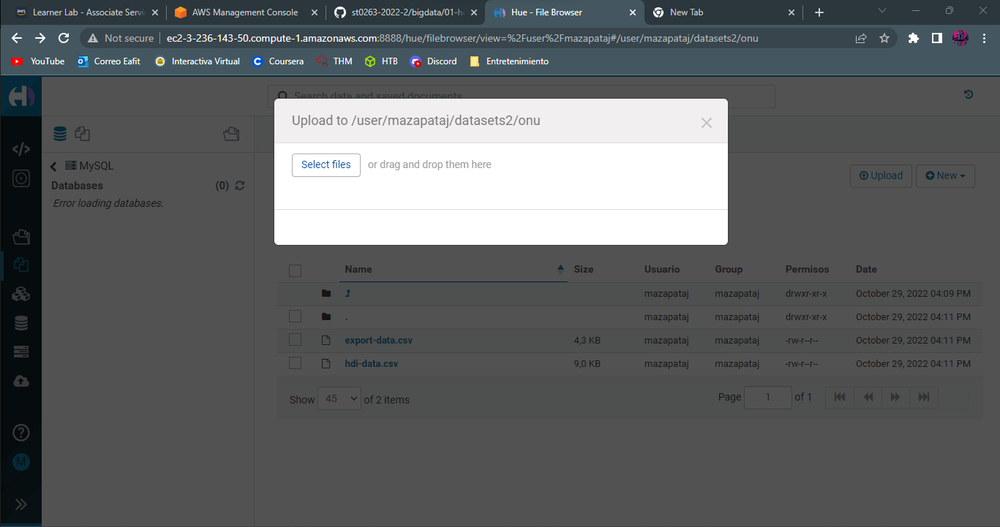  
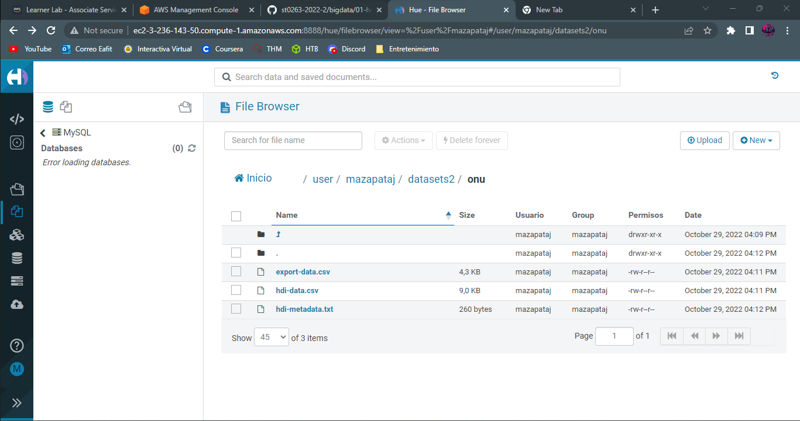   
  
* Ver contenido de archivo  
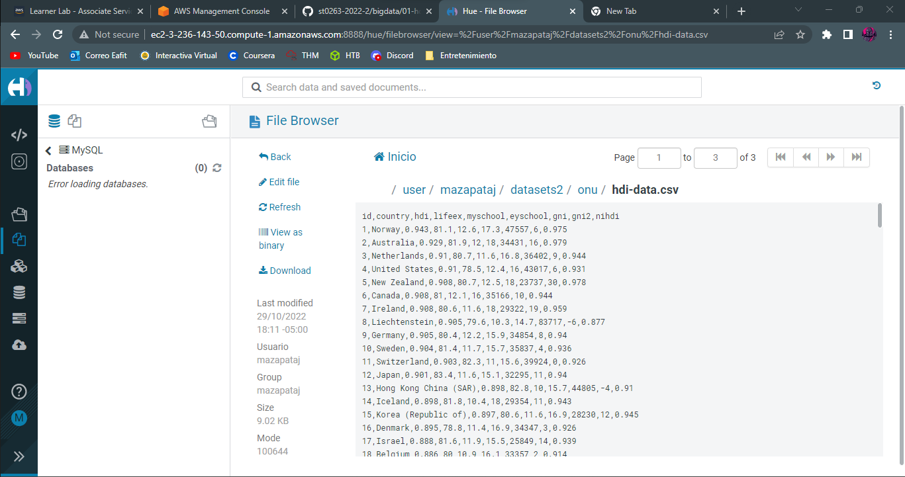  

---
  
## **3. Descripción del ambiente de ejecucion: lenguaje de programación, librerias, paquetes, etc, con sus numeros de versiones**  
  
### **Como se ejecuta y compila**  
  
1. Se accede de la siguiente manera luego de que el cluster se encuentre en ejecucion: Se dirije a la carpeta donde esta la clave .pem y se abre la terminal en ese ubicacion. Luego se ejecuta el siguiente comando para ingresar:  
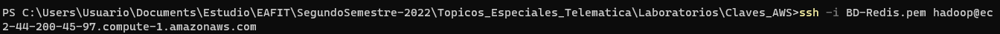  
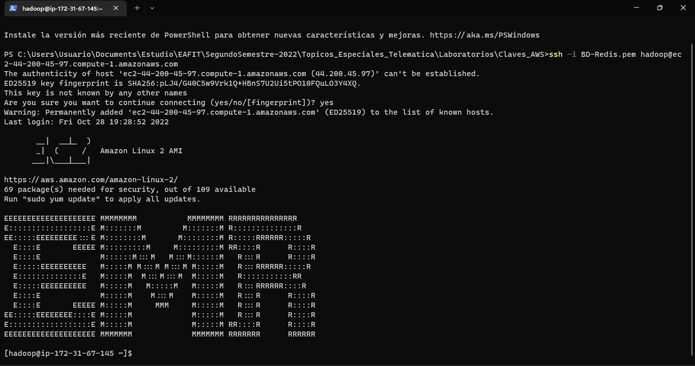  

---
## **5. Referencias**  

* [https://github.com/st0263eafit/st0263-2022-2/tree/main/bigdata/01-hdfs](https://github.com/st0263eafit/st0263-2022-2/tree/main/bigdata/01-hdfs)  
