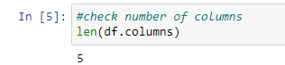
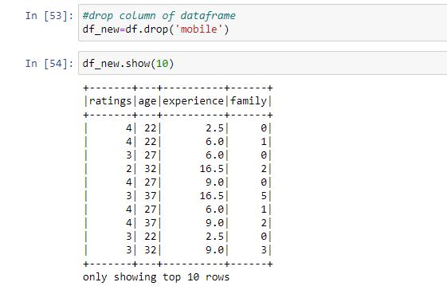
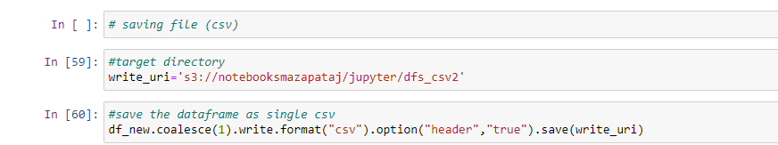

# **Lab06 - Spark**  
  
### **Información general**  
> Info de la materia: ST0263 Tópicos especiales en telemática  
> Estudiante: Miguel Ángel Zapata Jimenez, mazapataj@eafit.edu.co  
> Profesor: Edwin Nelson Montoya, emontoya@eafit.edu.co  
  
## **1. Breve descripción de la actividad**  
Se desarrollaro un contador de palabras usando pyspark. Ademas, se interactuo con pyspark de distintas maneras, que seran explicadas en este informe. Es importante resaltar, que gracias a las interaciones con pyspark, tambien se pudo desarrollar mejores competencias en el uso del servicio EMR y las distintas interfaces de usuario que provee. Tales como, HUE, JupyterHub y Zeppelin.   
  
---  

### **1.1. Que aspectos cumplió o desarrolló de la actividad propuesta por el profesor (requerimientos funcionales y no funcionales)**  
  
* Se logro ejecutar el wordcount por linea de comando 'pyspark' INTERACTIVO en EMR con datos en HDFS vía ssh en el nodo master.  
* Se logro ejecutar el wordcount por linea de comando 'pyspark' INTERACTIVO en EMR con datos en S3 (tanto de entrada como de salida)  vía ssh en el nodo master.  
* Se logro ejecutar el wordcount en JupyterHub Notebooks EMR con datos en S3 (tanto datos de entrada como de salida) usando un clúster EMR.  
* Se logro ejecutar el wordcount desde un archivo de python.
* Se logro replicar ejecutar y entender el notebook: Data_processing_using_PySpark.ipynb con los datos respectivos.
Tambien, se logro ejecutarlo en AWS EMR.  
  
---  
  
## **2. Descripción del ambiente de desarrollo y técnico: lenguaje de programación, librerias, paquetes, etc, con sus numeros de versiones**  
  
### **Detalles técnicos**  
  
**Plataforma de nube usada:** AWS (Amazon Web Services)  
**Sistema operativo:**  Amazon Linux 2 AMI  
**Servicio web utilizado:** EMR (Elastic MapReduce)  
**FrameWork de computación en cluster utilizado:** Spark
**Puerto para HUE:** 8888  
**Puerto para JupyterHub:** 9443  
**Puerto para Zeppelin:** 8890    
**Lenguaje de programación usado:** Python (3.10.7)  
**Librerias usadas:** pandas_udf, PandasUDFType, udf, StringType, DoubleType, IntegerType, pyspark

### **Adecuación del entorno de desarrollo**  
  
* Primero se debe lanzar el cluster e ingresar a el como se explica en [Lanzar servidor](#como-se-despliega-el-cluster)  
  
* Luego, se copiaran los archivos desde la máquina local al servidor EMR.  
  
  
  
  
* Por ultimo, se copian los archivos locales al servidor hdfs (HUE).  
  
  
  
---

### **2.1. Ejecución del wordcount via linea de comandos**  

* En la linea de comandos se copia el siguiente comando `pyspark`  
  
  
* Se procede a realizar la ejecución del wordcount donde se ejecutan los siguientes comandos  
    ```python  
        files_rdd = sc.textFile("hdfs:///datasets/gutenberg-small/*.txt")
        files_rdd = sc.textFile("s3://st0263datasets/gutenberg-small/*.txt")
        wc_unsort = files_rdd.flatMap(lambda line: line.split()).map(lambda word: (word, 1)).reduceByKey(lambda a, b: a + b)
        wc = wc_unsort.sortBy(lambda a: -a[1])
        for tupla in wc.take(10):
            print(tupla)
        wc.saveAsTextFile("hdfs:///tmp/wcout1")
    ```  
    En la imagen se muestra como se realizaria en linea de comandos. En este caso la salida del programa se guarda en diferentes archivos  
      
      

    Adicionalmente se muestra la forma en que se guarda la salida del programa en un solo archivo  
    ```python  
        files_rdd = sc.textFile("hdfs:///datasets/gutenberg-small/*.txt")
        files_rdd = sc.textFile("s3://st0263datasets/gutenberg-small/*.txt")
        wc_unsort = files_rdd.flatMap(lambda line: line.split()).map(lambda word: (word, 1)).reduceByKey(lambda a, b: a + b)
        wc = wc_unsort.sortBy(lambda a: -a[1])
        for tupla in wc.take(10):
            print(tupla)
        wc.coalesce(1).saveAsTextFile("hdfs:///tmp/wcout2") #Esta linea es la que se cambia
    ```  
      
      
      

--- 
      
### **2.2 Ejecutar el wordcount desde un archivo python**  
  
* Se crea un archivo pyhton como se muestra a continuación  
  
  
* Se ejecuta el archivo de python usando el siguiente comando `spark-submit --master yarn --deploy-mode cluster wc-pyspark.py`  
  

* Se verifica que se creo el archivo que contiene la salida del programa  
  
  
  
---
  
### **2.3 Ejecutar el wordcount desde Zeppelin notebook**  
  
* Se crea un notebook en zeppelin  
  
  
  
* Se copia en el notebook las siguientes lineas  
    ```python
        %spark2.pyspark
        # WORDCOUNT COMPACTO
        #files_rdd = sc.textFile("s3://datamazapataj/datasets/gutenberg-small/*.txt")
        files_rdd = sc.textFile("hdfs:/user/hadoop/datasets/gutenberg-small/*.txt")
        wc_unsort = files_rdd.flatMap(lambda line: line.split()).map(lambda word: (word, 1)).reduceByKey(lambda a, b: a + b)
        wc = wc_unsort.sortBy(lambda a: -a[1])
        for tupla in wc.take(10):
            print(tupla)
        wc.coalesce(1).saveAsTextFile("hdfs:///tmp/wcout4")
    ```  
  
* Se corre y en zeppelin se muestra cual es la salida  
  
  
* Finalmente, se verifica que el archivo se haya guardado de manera correcta  
  
  
  
---  
  
### **2.4 Ejecutar el wordcount desde Jupyter notebook en EMR**  
  
**WordCount en una sola sección**
  
* Lo primero que se hacer es iniciar la aplicación spark y verificar que el contexto esta correcto  
  
  
* Despues se copian las siguientes lineas en una sección del notebook, para luego ejecutarse  
  
Aqui podemos corroborar que el archivo se guardo de manera adecuada  
  
  
  
**WordCount paso a paso**  
  
* Primero se leera el archivo con el cual se realizara el conteo de palabras  
  
  
* Luego, se realizara un split para obtener cada letra del texto  
  
  
* Se realiza un análisis para determinar cuantas veces aparece la letra en el texto  
  
  
* A continuación se realizan dos operaciones para organizar las letras dependiendo de unas keys ya establecidas  
  
  
  
* Se guarda la salida del programa en un solo archivo  
  
  
* Se corrobora que el archivo quedo guardado. Para esto se verifica primero en HUE y luego en el servicio S3 de AWS  
  
  
  

---  

### **2.5 Replicación y ejecucion del notebook "Data_processing_using_PySpark.ipynb"**  
  
* Primero se importa la libreria SparkSesion para iniciar la aplicación spark  
  
  
* Se crea un objeto de SparkSesion  
  
  
* Se carga el dataframe con el cual se realizaran todas las operaciones y análisis  
  
  
* Se dan a conocer los nombres de las columnas que tiene el dataframe  
  
  
* Se determina el número de columnas que tiene el dataframe  
  
  
* Se determina el número de registros o filas que tiene el dataframe  
  
  
* Se imprime el número de columnas y filas que tiene el dataframe  
  
  
* Se muestra la estructua o esquema que tiene el dataframe. De esta manera se determina el tipo de dato de cada columna respectivamente  
  
  
* Se muestran solo la cantidad de filas que se indique  
  
  
* Se muestra solamente las columnas que se indiquen. Ademas, solo se muestran la cantidad de registros que se indique  
  
  
* Se muestra información general del dataframe  
  
  
* Luego de terminar los pasos anteriores se procede a importar los tipos de datos que se manejan en MySQL  
  
  
* Se realiza una estimación de cuanta edad tendra en 10 años y se muestra agrgando una columna en la visualización donde cada registro se le asigna la edad que tendra en 10 años  
  
  
* Se realiza una conversión de la edad que esta en entero a decimal y se muestra con una columna adicional en la visualización  
  
  
* Se realiza un filtro por un valor determinado de una columna  
  
  
* Se realiza un filtro por un valor determinado de ua columna y se muestran solo algunas columnas. Las que se especifican  
  
  
* Se realiza un filtro con multiples condiciones y luego se muestra el resultado  
  
  
  
* Se muetran los valores de una columna pero sin repetirse  
  
  
* Se indica cuantos valores no repetidos tiene una columna  
  
  
* Primero se agrupan los registros dependiendo de un valor de una determinada columna. Luego se indica cuantos registros tiene cada valor de la columna  
  
  
* Primero se agrupan los registros dependiendo de un valor de una determinada columna. Luego se realiza un promedio de cada valor de cada columna siempre teniendo como base la columna por la cual se agrupo.  
  
  
* Primero se agrupan los registros dependiendo de un valor de una determinada columna. Luego se suman los valores de cada columna teniendo como base la columna por la cual se agrupo  
  
  
* Primero se agrupan los registro por una columna. Luego se encuentra el valor maximo  
  
  
* Primero se agrupan los registro por una columna. Luego se encuentra el valor minimo  
  
  
* Primero se agrupan los registros por una columna y luego se realiza una suma de los valores correspondientes pero con una sola columna que se le indica  
  
  
* Se procede a importar UDF  
  
  
* Se crea una función de python que permite determinar el precio de una marca  
  
  
* Se crea un udf usando python. Luego se añade una columna a el dataframe para donde se determina el precio de cada marca usando la función de python  
  
  
* Usando una función lambda se determina si la persona es adulta o joven  
  
  
* Se importa pandas udf  
  
  
* Se crea una función para determinar cuantos años quedan de vida  

  
* Observar cauntos valores duplicados hay  
  
  
* Quitar valores duplicados a la hora de contar cuantos registros hay  
  
  
* Quitar una columan de un dataframe  

  
* Guardar archivo csv en un bucket  
  
  
  
* Guardar archivo csv al cual se le quito una columa en el bucket  
  
  
  
* Guardar archivo en formato parquet  
  
  
---

### **2.6 HIVE y SparkSQL. Gestión (DDL) y Consultas (DQL)**  
  
1. Primero hay que situarse en la sección HIVE  
  
  
2. Crear tabla hdi  
    ```SQL  
        use usernamedb;
        CREATE EXTERNAL TABLE HDI (id INT, country STRING, hdi FLOAT, lifeex INT, mysch INT, eysch INT, gni INT) 
        ROW FORMAT DELIMITED FIELDS TERMINATED BY ',' 
        STORED AS TEXTFILE 
        LOCATION 's3://datamazapataj/onu/hdi/'
    ```  
      
  
3. Mostrar las tablas que se han creado `show tables;`  

  
  
4. Mostrar la información de cada tabla  `describe hdi;`  

  
  
5. Mostrar el contenido de una tabla `select * from hdi;`  

  
  
6. Mostrar ciertas columnas y realizar filtro `select country, gni from hdi where gni < 2000;`  

  
  
7. Crear tabla para realizar un join despues  
    ```SQL  
        use usernamedb;
        CREATE EXTERNAL TABLE EXPO (country STRING, expct FLOAT) 
        ROW FORMAT DELIMITED FIELDS TERMINATED BY ',' 
        STORED AS TEXTFILE 
        LOCATION 's3://datamazapataj/datasets/onu/export/'
    ```  
      
      
8. Realizar JOIN `SELECT h.country, gni, expct FROM HDI h JOIN EXPO e ON (h.country = e.country) WHERE gni > 2000;`  

  
  
9. Crear tabla que contenga un texto al cual se le realizara un conteo de palabras  
    ```SQL
        use usernamedb;
        CREATE EXTERNAL TABLE docs (line STRING) 
        STORED AS TEXTFILE 
        LOCATION 'hdfs:///user/hadoop/datasets/gutenberg-small/';
    ```  
      
      
10. Conteo de palabras ordenado por palabra `SELECT word, count(1) AS count FROM (SELECT explode(split(line,' ')) AS word FROM docs) w GROUP BY word ORDER BY word DESC LIMIT 10;` 

  
  
11. Ordenado por frecuencia `SELECT word, count(1) AS count FROM (SELECT explode(split(line,' ')) AS word FROM docs) w GROUP BY word ORDER BY count DESC LIMIT 10;`  

  
  
---  
  
## **3. Descripción del ambiente de ejecución: lenguaje de programación, librerias, paquetes, etc, con sus numeros de versiones**  
  
## **Como se despliega el cluster**  
  
1. Se ingresa al servicio EMR que proporciona AWS  
  
  
2. Dado que ya se habian creado cluster, lo unico que se hace es clonar uno existente  
  
  
  
  
3. Luego se espera a que el cluster se inicie  
  
  
  
4. Por ultimo se ingresa via ssh  
  

  
---
  
## **4. Referencias**  
  
* [GitHub de la materia](https://github.com/st0263eafit/st0263-2022-2/tree/main/bigdata/03-spark)  
* [Documentación de AWS](https://docs.aws.amazon.com/emr/latest/ManagementGuide/emr-managed-notebooks-scoped-libraries.html)
  
  
