# **Proyecto3 - Spark con Notebooks y PySpark**  
  
### **Información general**  
> Info de la materia: ST0263 Tópicos especiales en telemática  
> Estudiante: Miguel Ángel Zapata Jimenez, mazapataj@eafit.edu.co  
> Profesor: Edwin Nelson Montoya, emontoya@eafit.edu.co  
  
## **1. Breve descripción de la actividad**  
Se hara uso del servicio Google Colab con el fin de realizar una serie de consultas via PySpark y SparkSQL. El acceso a los datos se hara a tráves de Google Drive y el servicio S3 de AWS. De esta manera se podra aprecias el potencial que tiene spark a la hora de procesar datos y mostrarlos a la hora de realizar consultas.  
  

### **1.1. Que aspectos cumplió o desarrolló de la actividad propuesta por el profesor (requerimientos funcionales y no funcionales)**  
  
* Se almacenaron datos en AWS S3 y en google drive.  
* Se cargaron datos desde AWS S3 y desde google drive.  
* Se realizo un análisis exploratorio del dataframe donde cargamos los datos.
* Se realizo un análisis exploratorio via SparkSQL. 
* Se contestaron una serie de preguntas sobre los datos de covid-19.  
  
---  
  
## **2. Descripción del ambiente de desarrollo y técnico: lenguaje de programación, librerias, paquetes, etc, con sus numeros de versiones**  
  
### **Codigos que se usaron**  
  
* [Codigo para realizar la conexión con S3 de AWS y guardar las consultas](Codigos/PySpark_AWS.ipynb)  

* [Codigo donde se realizaron las consultas](Codigos/Google_Colab_Consultas.ipynb)
  
### **Detalles técnicos**  
  
**Plataforma de nube usada:** AWS (Amazon Web Services)    
**Servicio de almacenamiento escalable en nube:** Amazon S3  
**FrameWork de computación en cluster utilizado:** Spark  
**Servicio para escribir codigo:** Google Colab  
**Lenguaje de programación usado:** Python (3.10.7)  
**Librerias usadas:** pandas_udf, PandasUDFType, udf, StringType, DoubleType, IntegerType, pyspark, SparkSQL  
  
### **Adecuación del entorno de desarrollo**  
  
**Manejo de datos con Google Drive**  
  
1. Lo primero que se realiza es la configuración del ambiente de desarrollo  
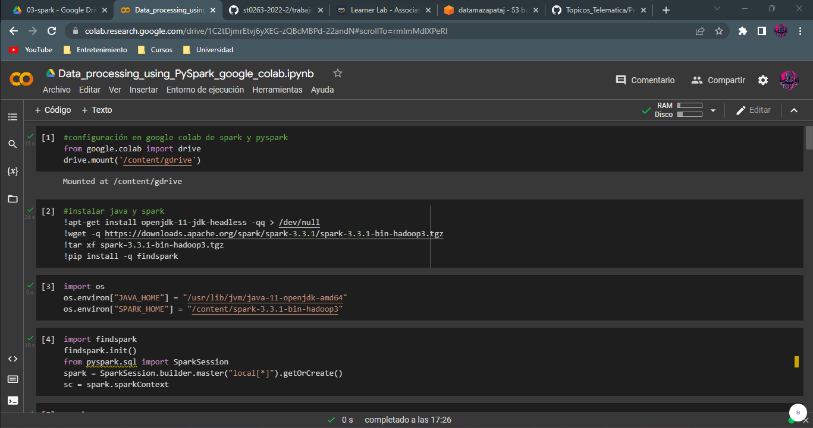  
  
2. Despues se procede a cargar el conjunto de datos correspondiente  
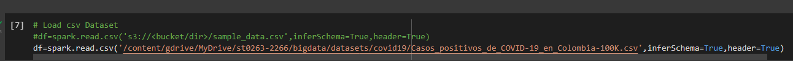  

  
**Manejo de datos con Amazon S3**  
  
1. Se cargan los datos en el bucket de Amazon S3  
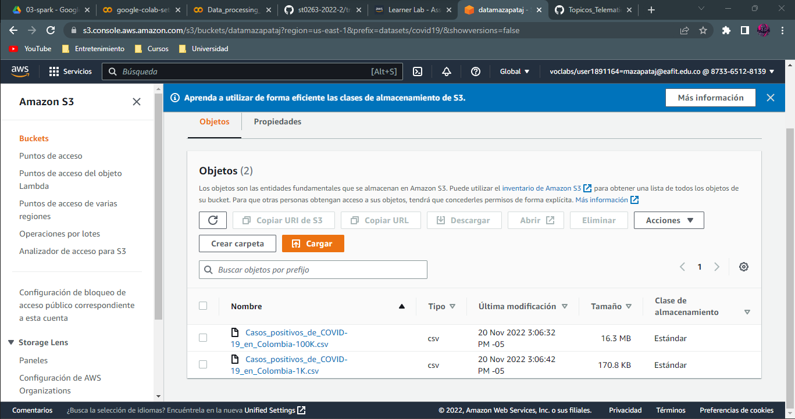
  
2. Lo primero que se realiza es la configuración del ambiente de desarrollo  
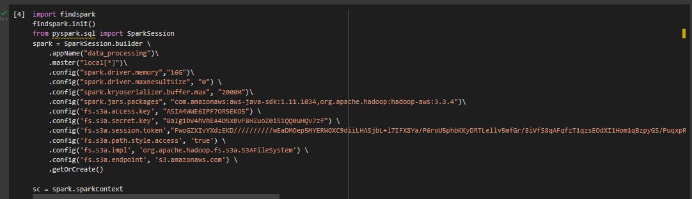  
  
3. Despues se cargan los datos que se van a analizar  
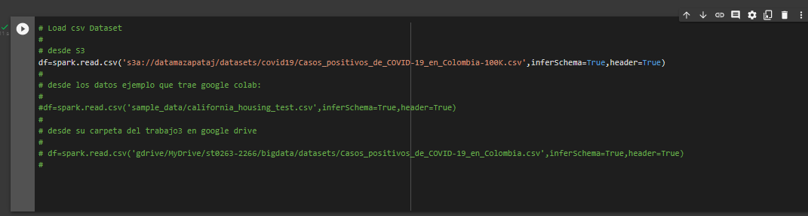  
  
### **2.1. Análisis exploratorio del dataframe**  
  
1. Se mostraran el nombre de las columnas del dataframe `df.columns`  

    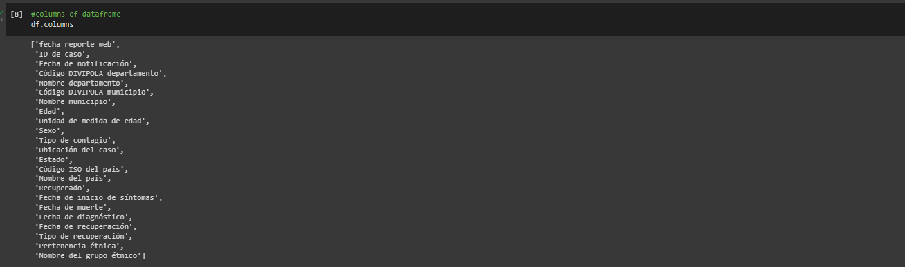  
  
2. Se mostrara el tipo de datos de las columnas `df.printSchema()`  

    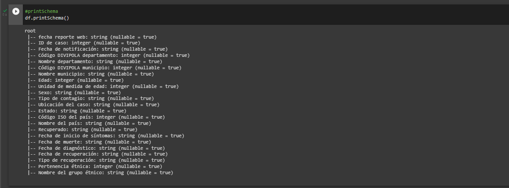  
  
3. Se mostrara solo algunas columnas `df.select('fecha reporte web','Fecha de notificación','Ubicación del caso','Fecha de muerte').show(5)`  

    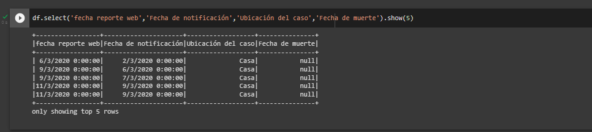  
      
4. Se renombrara una columna `df.select('Nombre departamento','Recuperado').withColumnRenamed('Recuperado','sano').show(5)`  
  
    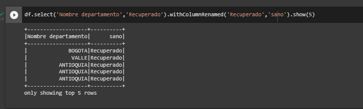  
      
5. Se procede a agregar una columna en la consulta `df.select('Fecha de notificación','Recuperado','Edad').withColumn("Edad despues de 10 años",(df["Edad"]+10)).show(10,False)`  
  
    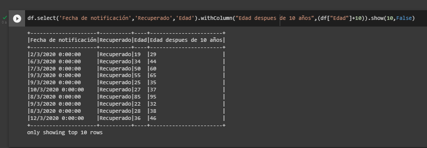  
      
6. Se procede a borrar una columna en la constula `df.select('ID de caso','Fecha de notificación','Recuperado','Edad').drop('Fecha de notificación').show(5)`  
  
    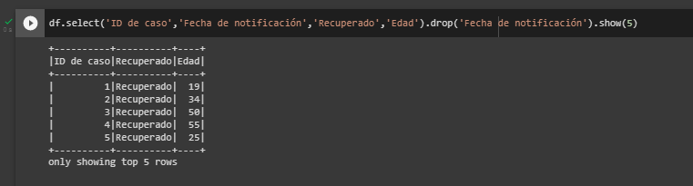  
      
7. Se procede a realizar un filtro `df.filter(df['Edad']>30).show(5)`  
  
    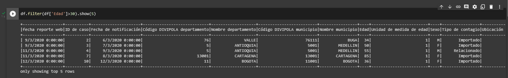  
      
8. Ejecutar función udf  
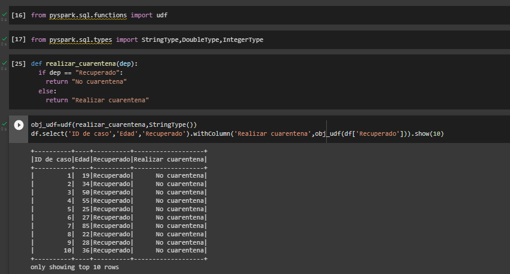  
  
### **2.2. Respuesta de preguntas sobre el Covid 19**  
  
1. Los 10 departamentos con más casos de covid en Colombia ordenados de mayor a menor  

    **En PySpark:** `df.groupBy('Nombre departamento').count().orderBy('count',ascending=False).show(10,False)`  

    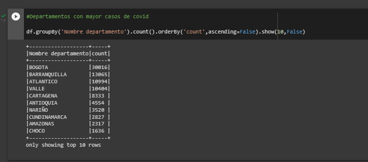  
    
    **En SparkSQL:** `spark.sql("""SELECT `Nombre departamento`, COUNT(*) FROM covid GROUP BY `Nombre departamento` ORDER BY 2  DESC""").show(10)`  
    
    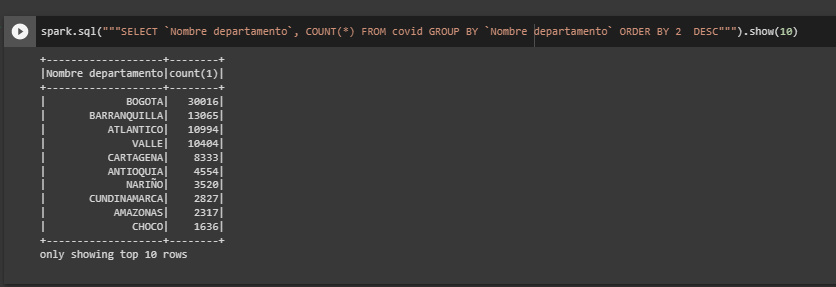  
      
2. Las 10 ciudades con más casos de covid en Colombia ordenados de mayor a menor  

    **En PySpark:** `df.groupBy('Nombre municipio').count().orderBy('count',ascending=False).show(10,False)`  

    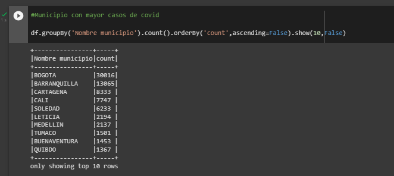  
    
    **En SparkSQL:** `spark.sql("""SELECT `Nombre municipio`, COUNT(*) FROM DbCovid GROUP BY `Nombre municipio` ORDER BY 2  DESC""").show(10)`  
    
    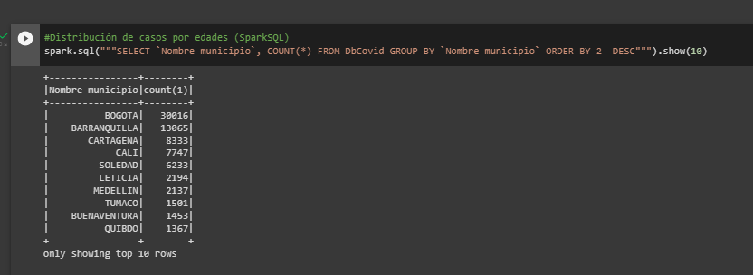  
      
3. Los 10 días con más casos de covid en Colombia ordenados de mayor a menor  

    **En PySpark:** `df.groupBy('Fecha de notificación').count().orderBy('count',ascending=False).show(10,False)`  

    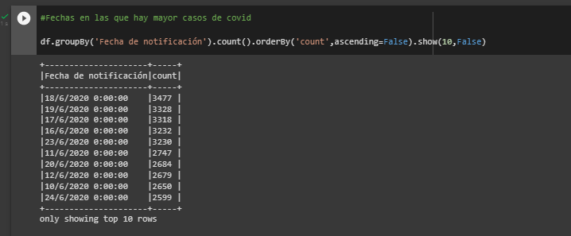  
    
    **En SparkSQL:** `spark.sql("""SELECT `Fecha de notificación`, COUNT(*) FROM covid GROUP BY `Fecha de notificación` ORDER BY 2  DESC""").show(10)`  
    
    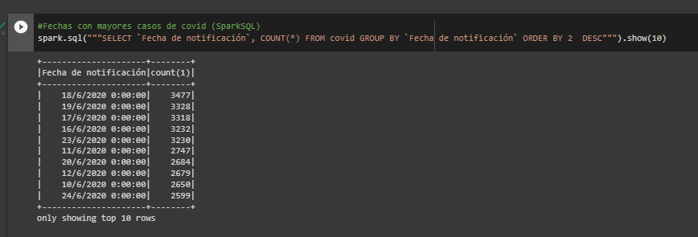  
      
4. Distribución de casos por edades de covid en Colombia  

    **En PySpark:** `df.groupBy('Edad').count().orderBy('Edad',ascending=True).show()`  

    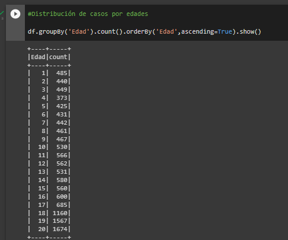  
    
    **En SparkSQL:** `spark.sql("""SELECT Edad, COUNT(*) FROM DbCovid GROUP BY Edad""").show(10)`  
    
    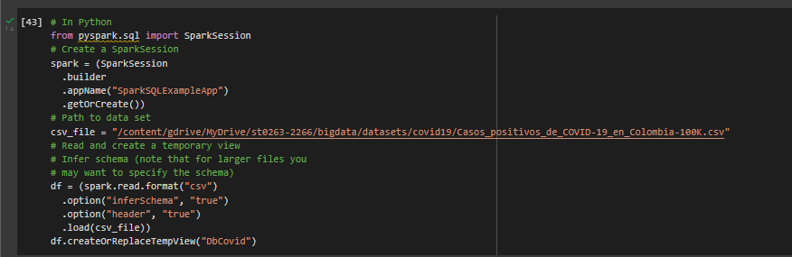  
      
5. Cuantos casos de personas recuperadas y fallecidas hay. Se incluye las personas que no tuvieron COVID  

    **En PySpark:** `df.groupBy('Recuperado').count().orderBy('count').show()`  

    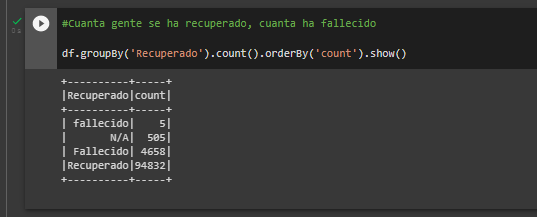  
    
    **En SparkSQL:** `spark.sql("""SELECT Recuperado, COUNT(*) FROM covid GROUP BY Recuperado ORDER BY 2  DESC""").show(10)`  
    
    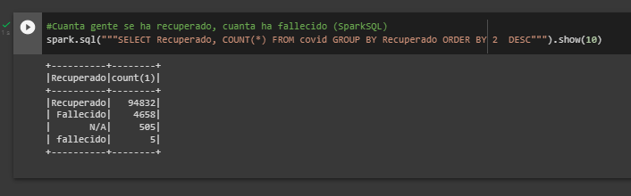  
      
### **2.3. Guardar resultado de las consultas en Amazon S3**  

* A continuación se muestra como se realizar el guardado de cada una de las consultas  
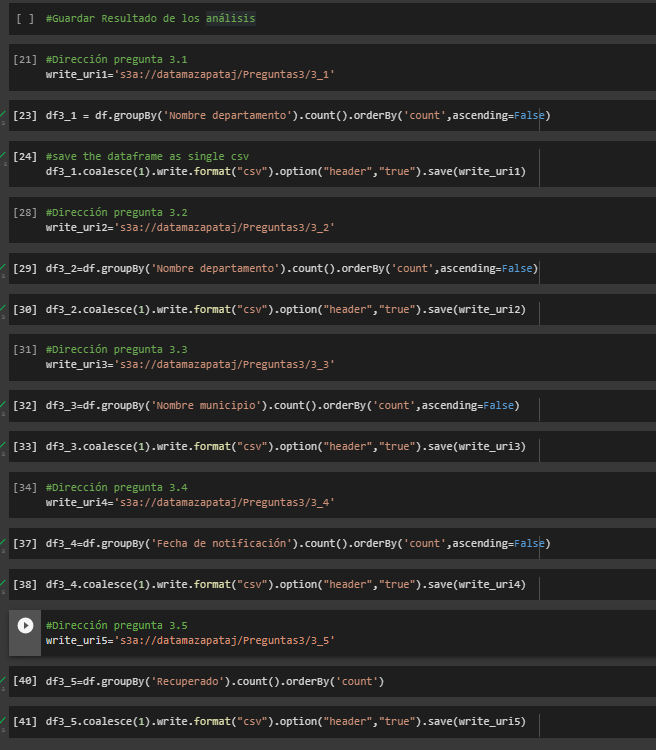  
  
* Verificación de que las consultas quedaron realmente guardadas  
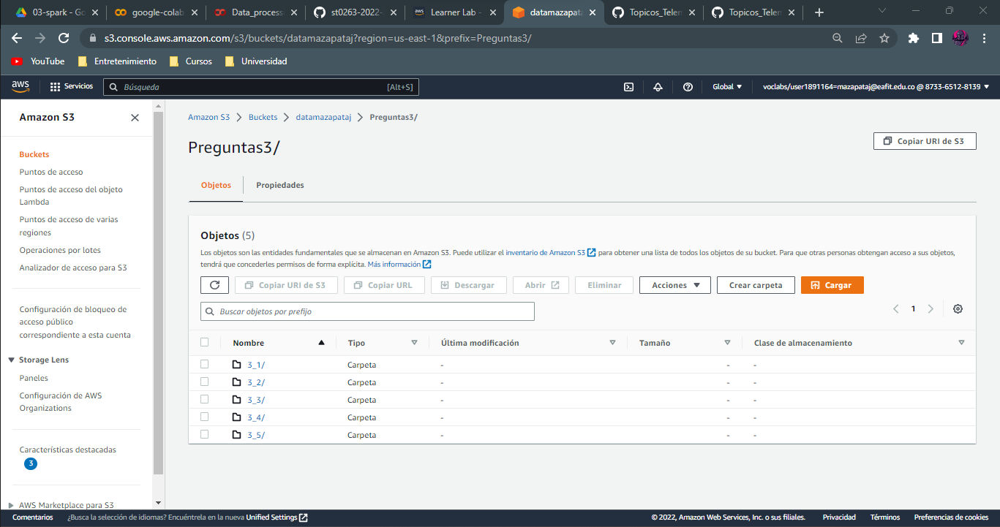
  
---  
  
## **3. Referencias**  
  
[GitHub de la materia](https://github.com/st0263eafit/st0263-2022-2/blob/main/bigdata/trabajo3-pyspark.txt)    
[Documentación de SparSQL](https://spark.apache.org/docs/latest/sql-programming-guide.html)  
[Documentación de PySpark](https://spark.apache.org/docs/latest/api/python/)
